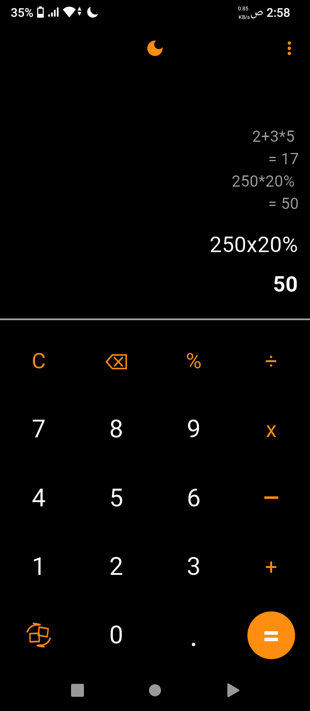
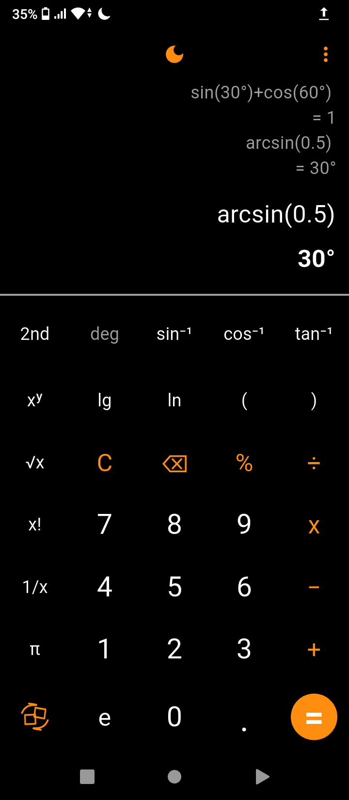
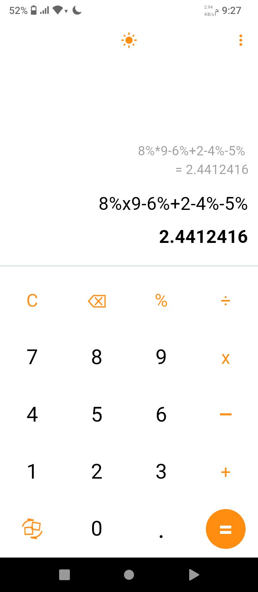
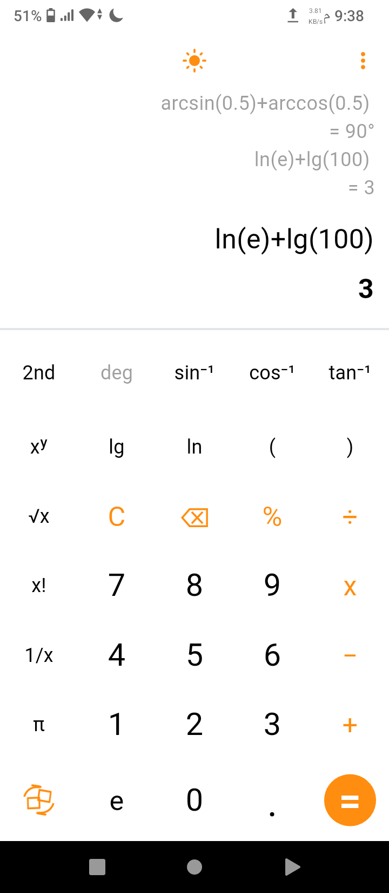
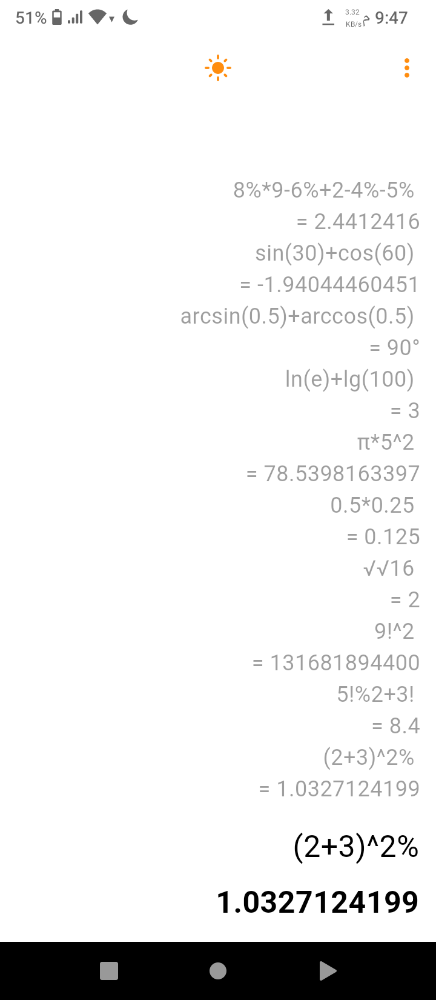

# Flutter Scientific Calculator

A feature-rich scientific calculator app built with Flutter, featuring advanced mathematical expression parsing and a clean, intuitive interface.

## Features

### Core Functions
- Basic arithmetic: `+`, `-`, `×`, `÷`
- Power operations: `x^y`, `x⁻¹`
- Square root & nested roots: `√x`
- Factorials: `n!`
- Percentages: smart context-aware handling
- Parentheses: automatic balancing

### Scientific Functions
- **Trigonometric**: `sin`, `cos`, `tan` (supports both **DEGREE** and **RADIAN** modes)
- **Inverse trig**: `sin⁻¹`, `cos⁻¹`, `tan⁻¹`
- **Logarithms**: `log`, `ln`
- **Constants**: `π`, `e`

### Smart Parsing
- Converts display symbols to evaluable expressions
- Handles implicit multiplication: `2π`, `2ln(2)`
- Auto-closes parentheses: `sin(30` → `sin(30)`
- Nested function support: `sin(cos(30))`
- Factorial-exponent precedence: `9!^2` → `(9!)^2`
- Percentage inside expressions: `5!%2`, `(2+3)^(2%)`

### User Interface
- Clean, modern layout
- Light/Dark theme toggle
- Scrollable calculation history
- Smart expression formatting
- **Degree/Radian mode indicator and toggle**

## Built With

- [Flutter](https://flutter.dev/) - UI framework
- [math_expressions v3.1.0](https://pub.dev/packages/math_expressions) - Mathematical expression parsing and evaluation
- [Provider v6.1.5+1](https://pub.dev/packages/provider) - State management
- [Hive v2.2.3](https://pub.dev/packages/hive) - Fast, lightweight local database
- [Hive Flutter v1.1.0](https://pub.dev/packages/hive_flutter) - Flutter integration for Hive

## Screenshots

<div align="center">
  <table>
    <tr>
      <td align="center"><b>Simple Mode (Dark)</b></td>
      <td align="center"><b>Scientific Mode (Dark)</b></td>
    </tr>
    <tr>
      <td></td>
      <td></td>
    </tr>
    <tr>
      <td align="center"><b>Simple Mode (Light)</b></td>
      <td align="center"><b>Scientific Mode (Light)</b></td>
    </tr>
    <tr>
      <td></td>
      <td></td>
    </tr>
    <tr>
      <td align="center" colspan="2"><b>History View</b></td>
    </tr>
    <tr>
      <td colspan="2" align="center"></td>
    </tr>
  </table>
</div>

## Key Implementation Highlights

- **Dual Angle Mode**: Full support for both DEGREE and RADIAN modes with easy toggle
- Uses **GrammarParser** for parsing expressions
- Custom handling for precision, roots, and angles
- Smart percentage & factorial-exponent evaluation
- Auto parentheses and implicit multiplication detection
- Supports nested functions and mixed operations

## Installation

### Prerequisites
- Flutter SDK `3.35.5` or higher
- Dart SDK `3.9.2` or higher

### Steps

```bash
# Clone the repository
git clone https://github.com/WagdiSaif/flutter-calculator.git

# Navigate to project folder
cd flutter-calculator

# Install dependencies
flutter pub get

# Run the app
flutter run
```

## Contact

For questions or suggestions, reach out at:

- **Email:** [Wagdi](mailto:wagdisaif121@gmail.com)
- **GitHub:** [@Wagdi](https://github.com/WagdiSaif)

## License

This project is licensed under the MIT License – see the [LICENSE](LICENSE) file for details.